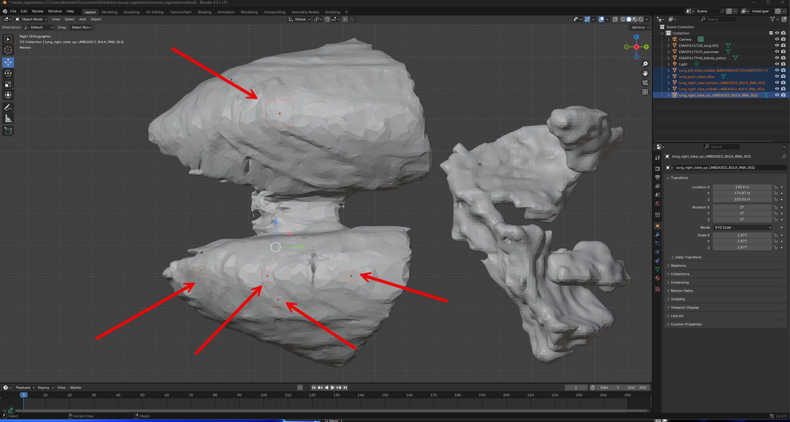

# Data

## Stage: Theiler 21 (E12.5):

- [3D section viewer](https://www.emouseatlas.org/eAtlasViewer_ema/application/ema/anatomy/EMA146.php)
- [Model data](https://doi.org/10.7488/ds/2181)

## Stage: Theiler 24 (E16):

_--This does not have any surfaces in the STL format!--_

- [3D section viewer](https://www.emouseatlas.org/eAtlasViewer_ema/application/ema/anatomy/EMA148.php)
- [Model data](https://doi.org/10.7488/ds/2168)

## Stage: Theiler 25 (E17.0):

_--This one is used for the screenshot below--_

- [3D section viewer](https://www.emouseatlas.org/eAtlasViewer_ema/application/ema/anatomy/EMA149.php)
- [Model data](https://doi.org/10.7488/ds/2169)

Models for almost all other stages of mouse development are available [here](https://datashare.ed.ac.uk/handle/10283/2805)

## Organs needed & provided

- Lung (provided by emouse)
- Ovary (**_not_** provided by emouse)
- Muscle (**_not_** provided by emouse)
- Kidney (provided by emouse)
- Pancreas (provided by emouse)

Four STL files were provided, see [here](models/emouse/).

Screenshot of all three in one Blender scene (from Stage: Theiler 25 [E17.0]), see metadata [here](https://datashare.ed.ac.uk/bitstream/handle/10283/2856/model_info.txt?sequence=2&isAllowed=y):

## Related Paper

From [https://www.researchgate.net/figure/Large-scale-structure-of-the-mouse-lung-The-right-lung-has-4-lobes-and-the-left-lung-has_fig8_276464605](https://www.researchgate.net/figure/Large-scale-structure-of-the-mouse-lung-The-right-lung-has-4-lobes-and-the-left-lung-has_fig8_276464605)

](Large-scale-structure-of-the-mouse-lung-The-right-lung-has-4-lobes-and-the-left-lung-has.jpg)

# 3D Models and Registration

## Lung

7 blocks positioned, the team receives the lung tissues only from JAX

# Pancreas

Team is unsure who will handle pancreas registrations

# Kidney

Team has no information

Team will reach out to 5x5 team, who will provide information for kidney and pancreas

# Ovary

Need reference organ and collaborators

# Muscle

Need reference organ and collaborators
