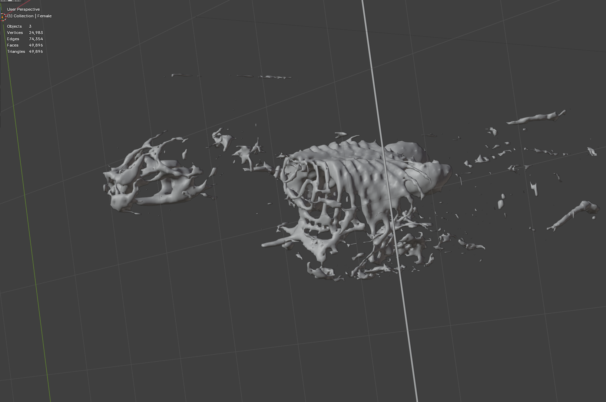
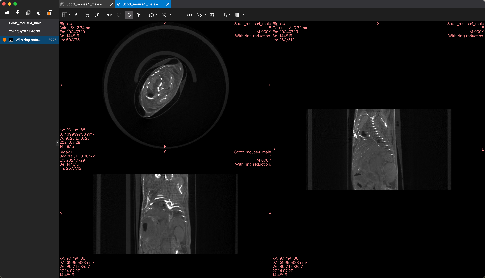
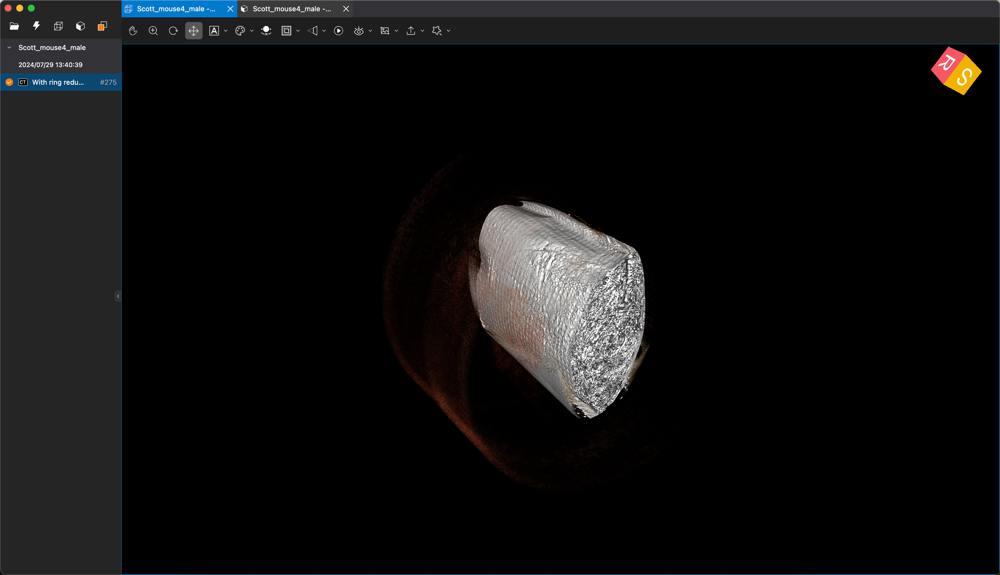
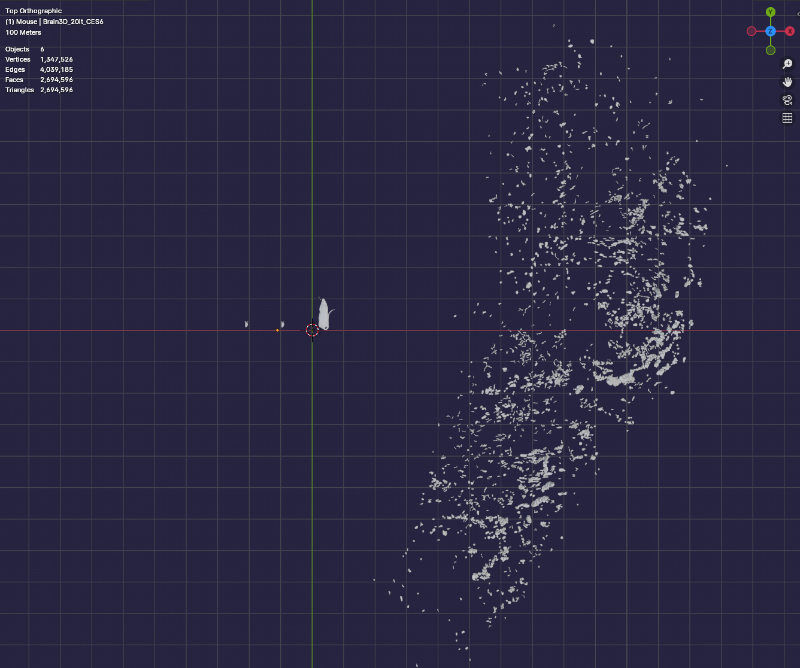
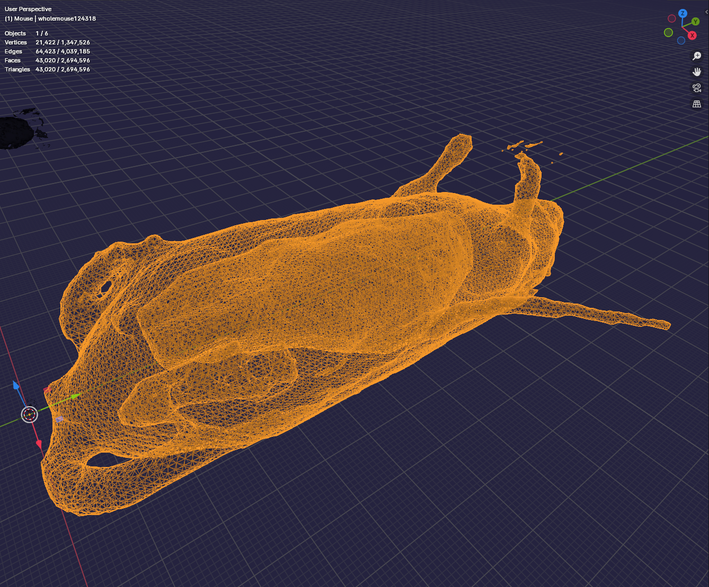
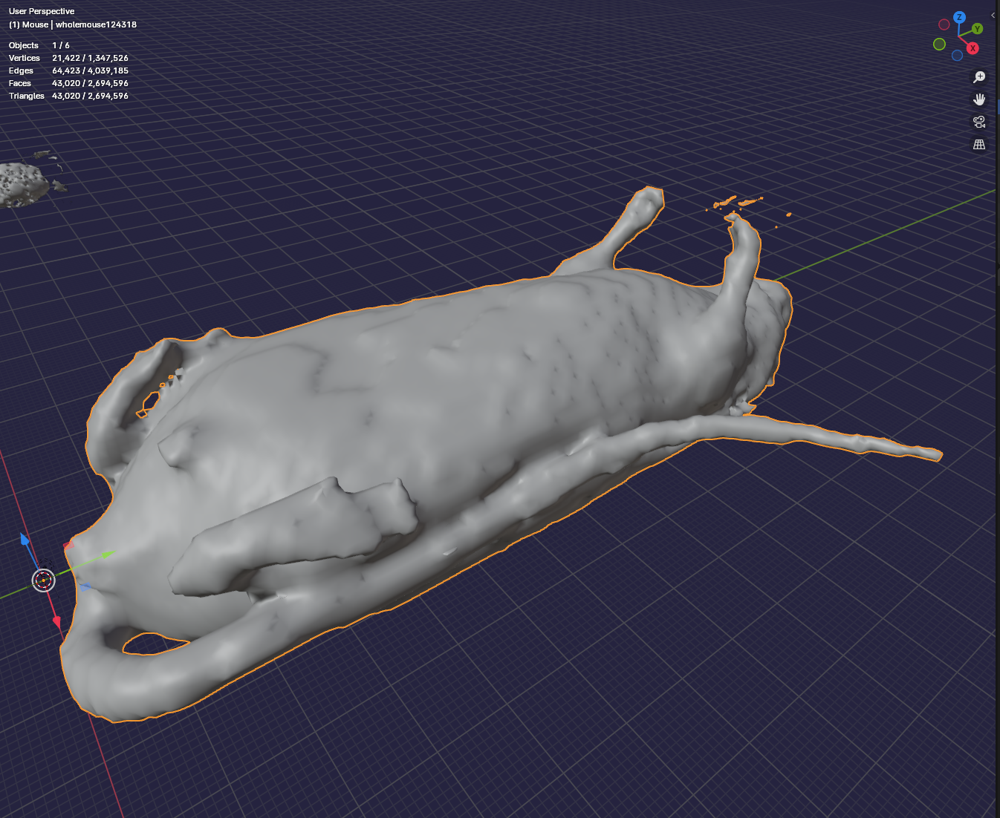
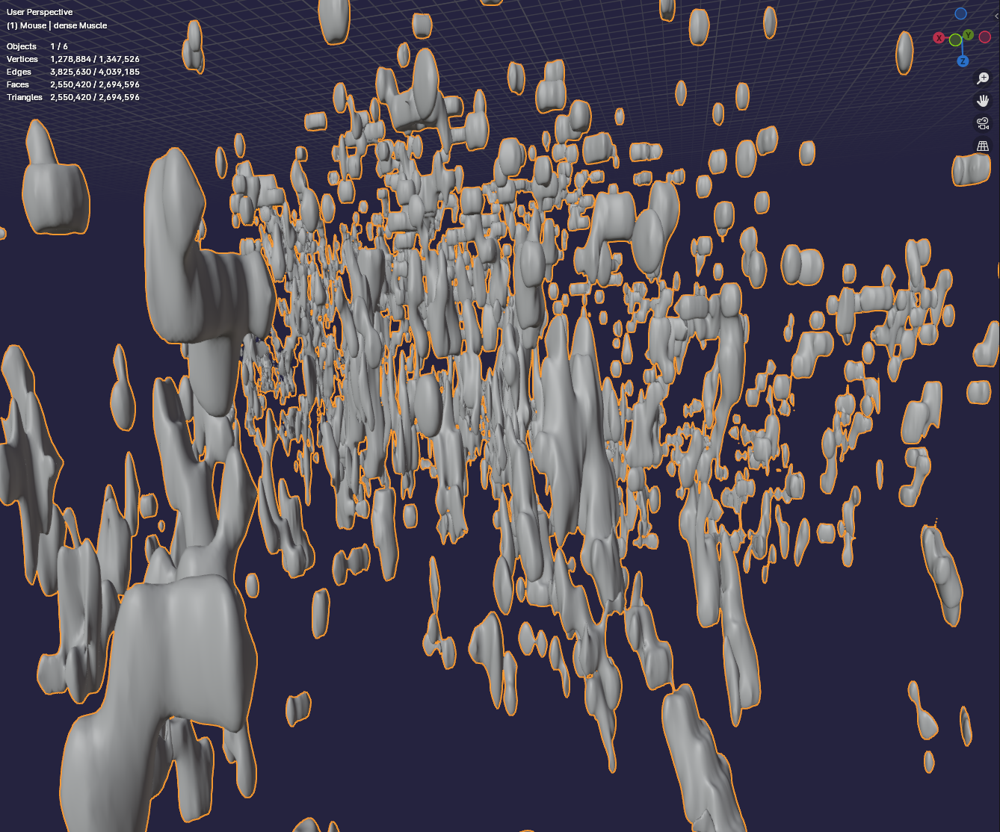
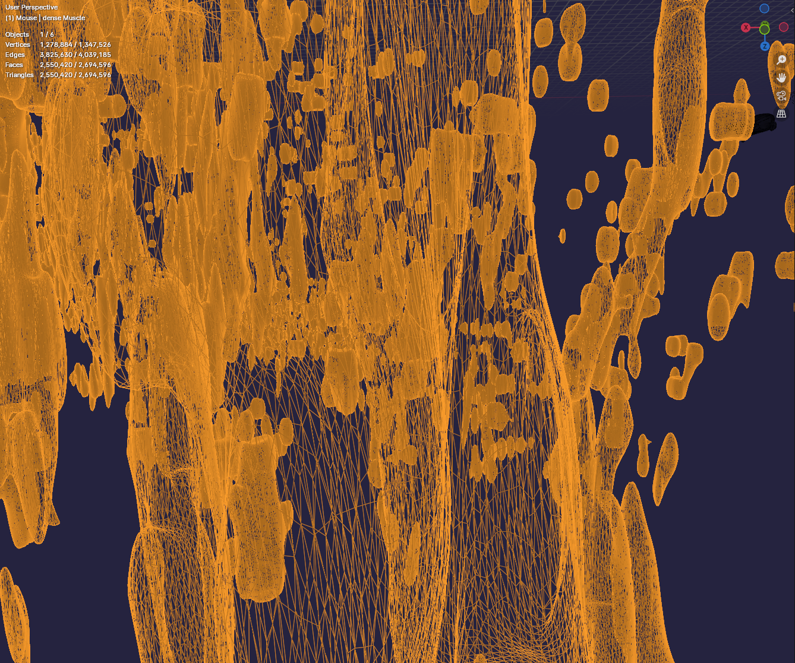
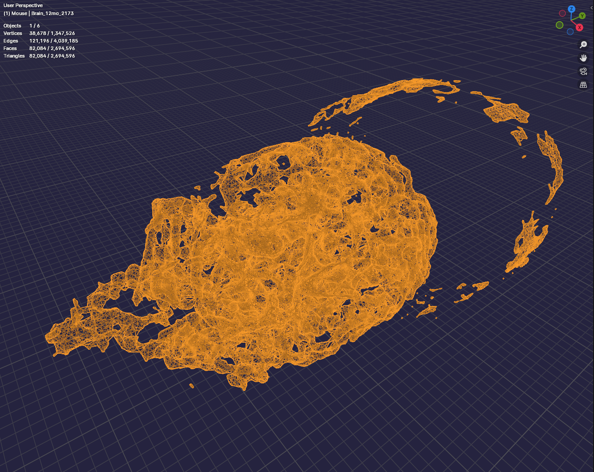
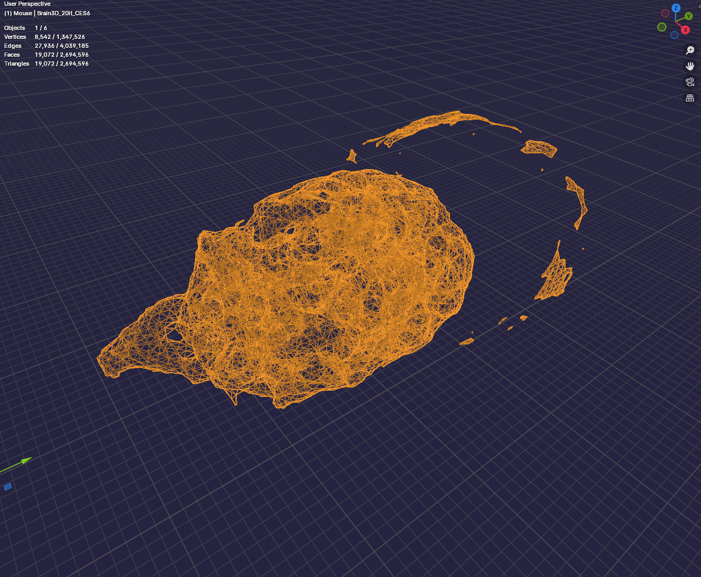

# Data

## Data shared in February 2025
Simon shares: 3D model of female mouse - ovary, lung, kidney, and partial skeleton (for reference). Muscle coming next week.

## Overview DICOMs (8/5/24)
A stack with 275 DICOM images were shared by Simon. Andi uses bee DICOM viewer to visualize them:

- triple view:

- 3D view: 

## Overview 3D models (pre-August 2024)

Four STL files were provided. One is too big to easily upload to GitHub, so three models are shown [here](models/melov/). All four models show:

- whole mouse
- dense muscle (this model is too large for GitHub, so we deposited it on [Google Drive](https://drive.google.com/drive/folders/1dPacP1yNMPnQvoqJdwNh5rd6FNZe7Dgg?usp=sharing))
- brain at 12 months
- brain 3D, 20 IT

## Model sizes

| STL file name                        | \#Polygons |
| ------------------------------------ | ---------- |
| "models/melov/wholemouse124318.stl"  | 43,020     |
| "models/melov/dense Muscle.stl"      | 2,550,420  |
| "models/melov/Brain_12mo_2173.stl"   | 82,084     |
| "models/melov/Brain3D_20it_CES6.stl" | 19,072     |

# 3D Models and Registration

Screenshots are shown below.

All four models next to each other (notice the scale difference)

The whole mouse as wireframe:

The whole mouse, solid viewport shading:

Dense muscle, solid viewport shading:

Dense muscle as wireframe:

Brain 12 months:

Brain 3D 20 IT:

