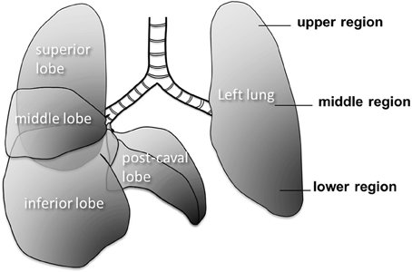

From [https://www.researchgate.net/figure/Large-scale-structure-of-the-mouse-lung-The-right-lung-has-4-lobes-and-the-left-lung-has_fig8_276464605](https://www.researchgate.net/figure/Large-scale-structure-of-the-mouse-lung-The-right-lung-has-4-lobes-and-the-left-lung-has_fig8_276464605)

# Lung
3 blocks positioned, the team receives the lung tissues only from JAX

# Pancreas
Team is unsure who will handle pancreas registrations

# Kidney
Team has no information

Team will reach out to 5x5 team, who will provide  information for kidney and pancreas