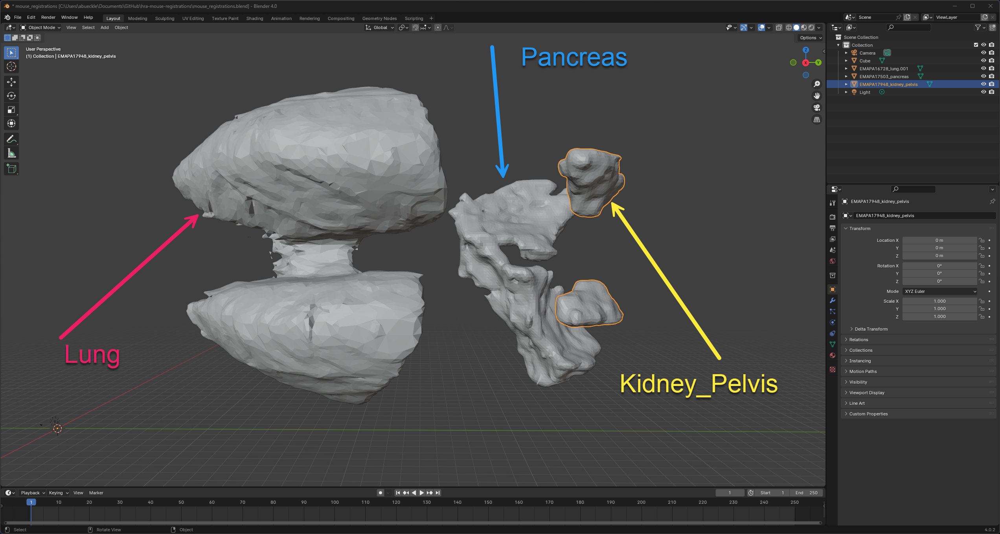

# Mouse 5x5 Registrations using Blender
## Overview 
This repository contains data and Blender files for manually registering tissue blocks for the mouse. 

### Stage: Theiler 21 (E12.5):
- [3D section viewer](https://www.emouseatlas.org/eAtlasViewer_ema/application/ema/anatomy/EMA146.php)
- [Model data](https://doi.org/10.7488/ds/2181)

### Stage: Theiler 24 (E16):
*--This does not have any surfaces in the STL format!--*
- [3D section viewer](https://www.emouseatlas.org/eAtlasViewer_ema/application/ema/anatomy/EMA148.php)
- [Model data](https://doi.org/10.7488/ds/2168)

### Stage: Theiler 25 (E17.0): 
*--This one is used for the screenshot below--*
- [3D section viewer](https://www.emouseatlas.org/eAtlasViewer_ema/application/ema/anatomy/EMA149.php)
- [Model data](https://doi.org/10.7488/ds/2169)

Models for almost all other stages of mouse development are available [here](https://datashare.ed.ac.uk/handle/10283/2805)

## Organs needed & provided
 - Lung (provided by emouse)
 - Ovary (***not*** provided by emouse)
 - Muscle (***not*** provided by emouse)
 - Kidney (provided by emouse)
 - Pancreas (provided by emouse)

 Screenshot of all three in one Blender scene (from Stage: Theiler 25 [E17.0]), see metadata [here](https://datashare.ed.ac.uk/bitstream/handle/10283/2856/model_info.txt?sequence=2&isAllowed=y): 

 

